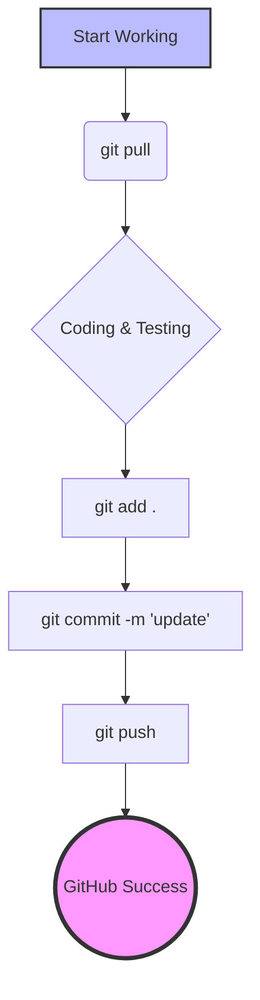

# 🦾 AI Rehab System (AI 復健系統)

[](https://www.python.org/)
[](https://flask.palletsprojects.com/)
[](https://google.github.io/mediapipe/)

> **An intelligent motion analysis system for elderly rehabilitation.**
> **專為老年人設計的智慧化復健運動學分析系統。**

---

## 📸 Demo Showcase


---

這是一套結合 **電腦視覲 (MediaPipe)** 與 **機器學習 (Scikit-learn)** 的智慧復健系統，專為老年人「從坐到站 (Sit-to-Stand)」動作設計。系統能即時偵測骨架、計算關節角度，並透過 AI 模型分析動作階段，提供即時回饋。

---

## 🏗️ 系統架構 (System Architecture)

### 技術棧 (Technology Stack)

| 層級 | 技術 | 用途 |
|:---|:---|:---|
| **前端框架** | HTML5 + CSS3 + JavaScript | 使用者介面與即時影像擷取 |
| **後端框架** | Flask (Python 3.9+) | Web 伺服器與 RESTful API |
| **電腦視覺** | MediaPipe Pose | 33 點人體骨架即時偵測 |
| **影像處理** | OpenCV (cv2) | 影片讀取、畫面處理與視覺化疊加 |
| **機器學習** | Scikit-learn (Random Forest) | 動作分類模型 (健康/衰弱/代償) |
| **資料處理** | Pandas + NumPy | 特徵工程與資料分析 |

---

### 系統流程 (Data Pipeline)


---

### 核心功能模組 (Core Modules)

#### 1. **骨架偵測模組** (`utils/processor.py`)
- **技術**：MediaPipe Pose (33-landmark model)
- **功能**：
  - 即時追蹤 33 個人體關鍵點 (肩膀、髖部、膝蓋、腳踝等)
  - 動態偵測左/右側運動
  - 計算軀幹前傾角度、膝關節角度、手膝距離

#### 2. **AI 診斷模型** (`model/train_model.py`)
- **演算法**：Random Forest Classifier
- **輸入特徵** (4 項生物力學指標)：
  - `X1_MaxTrunkLean`：最大軀幹前傾角度 (°)
  - `X2_TotalDuration`：動作總時長 (秒)
  - `X3_MinHandKneeDist`：最小手膝距離 (像素)
  - `X4_EndKneeAngle`：終止膝關節角度 (°)
- **輸出分類**：
  - `0 = 健康 (Healthy)`：動作標準
  - `1 = 衰弱風險 (Frailty)`：軀幹過度前傾
  - `2 = 代償動作 (Compensation)`：手扶膝蓋借力

#### 3. **視覺化引擎** (`utils/visualizer.py`)
- **技術**：OpenCV Video Writer
- **功能**：
  - 在原始影片上疊加骨架線條
  - 動態標註關鍵角度數值
  - 嵌入 AI 診斷結果與建議文字

---

### 專案結構 (Project Structure)

```
AI_Rehab_System/
├── app.py                   # Flask 主程式 (路由與業務邏輯)
├── config.py                # 設定檔 (路徑、模型參數)
├── requirements.txt         # Python 依賴套件清單
│
├── model/                   # AI 模型訓練與儲存
│   ├── train_model.py       # 從 CSV 訓練模型
│   ├── train_from_videos.py # 從影片批次訓練
│   └── rehab_model.pkl      # 訓練好的模型檔 (Random Forest)
│
├── utils/                   # 核心工具模組
│   ├── processor.py         # 骨架偵測 + 特徵計算
│   └── visualizer.py        # 結果影片生成
│
├── templates/               # HTML 模板
│   ├── index.html           # 首頁 (檔案上傳)
│   ├── record.html          # 即時錄影頁 (WebRTC)
│   └── result.html          # 結果展示頁
│
├── static/                  # 靜態資源 (CSS/JS)
├── uploads/                 # 使用者上傳影片暫存
├── results/                 # 分析結果 (CSV + 視覺化影片)
└── training_data/           # 訓練資料集
```

---

## 🚀 快速開始 (Quick Start)

### 1. **環境準備**
安裝 [Python 3.9+](https://www.python.org/downloads/) (勾選 **Add Python to PATH**) 與 [Git](https://git-scm.com/downloads)。

### 2. **下載專案**
```bash
git clone https://github.com/Yile516/AI_Rehab_System.git
cd AI_Rehab_System
```

### 3. **安裝依賴**
```bash
pip install -r requirements.txt
```

### 4. **啟動系統**
```bash
python app.py
```
打開瀏覽器輸入 `http://127.0.0.1:5000` 即可開始使用。

---

## 📊 系統截圖 (Screenshots)

<p align="center">
  
  
</p>

---

## 📂 開發與同步指南 (Git Guide)

### 🔄 Git Cheat Sheet (常用指令懶人包)

當你在不同電腦切換工作時，請遵循以下流程：

| 動作 (Action) | 指令 (Command) | 使用時機 (When to use) |
|:---|:---|:---|
| **開始工作** | `git pull` | 每次打開電腦先執行，獲取雲端最新版本。 |
| **收集修改** | `git add .` | 修改完程式碼後，準備進行存檔。 |
| **本地存檔** | `git commit -m "備註"` | 為這次的修改留下紀錄。 |
| **推送到雲端** | `git push` | 正式同步到 GitHub 網頁。 |

---

### 🏗️ 工作流程視覺化 (Workflow)



---

## 🔬 技術細節 (Technical Details)

### MediaPipe Pose 關鍵點定義
系統使用 MediaPipe 的 33 點模型，主要分析以下關鍵點：
- **軀幹**：肩膀 (11, 12) → 髖部 (23, 24)
- **下肢**：髖部 → 膝蓋 (25, 26) → 腳踝 (27, 28)
- **上肢**：手腕 (15, 16) 用於偵測代償動作

### 特徵工程原理
| 特徵 | 計算方法 | 臨床意義 |
|:---|:---|:---|
| 軀幹前傾角 | `arctan(Δy / Δx)` | 核心肌力指標 |
| 動作時長 | 從坐到站的總幀數 | 肌力衰弱篩檢 |
| 手膝距離 | `√((x₁-x₂)² + (y₁-y₂)²)` | 代償動作偵測 |
| 膝關節角 | 三點向量夾角 | 動作完成度 |

---

## 📜 License

© 2026 Yile516 - AI Rehab System Project
