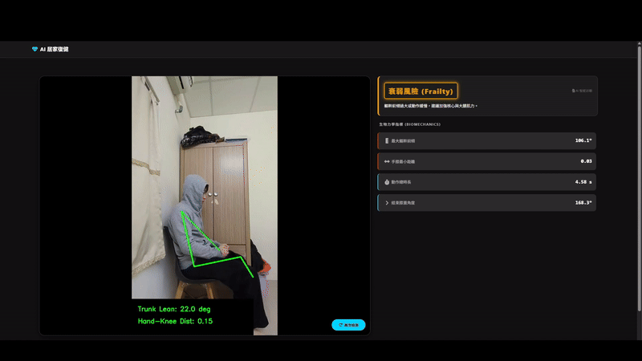
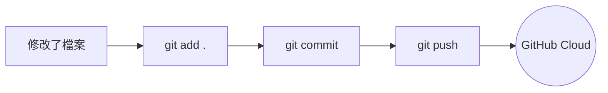

# AI Rehab System (AI 復健系統)



這是你的 AI 復健系統專案。以下說明如何在其他電腦上下載並執行這個程式。
## 1. 在新電腦上的準備工作
在開始之前，請確保新電腦已經安裝：
1.  **Python** (建議 3.9 或以上版本): [下載 Python](https://www.python.org/downloads/)
    *   *安裝時記得勾選 "Add Python to PATH"*
2.  **Git**: [下載 Git](https://git-scm.com/downloads)

## 2. 下載專案 (Clone)
打開終端機 (CMD 或 PowerShell)，執行以下指令將專案下載到那台電腦：
```bash
git clone https://github.com/Yile516/AI_Rehab_System.git
cd AI_Rehab_System
```

## 3. 安裝套件
下載完後，需要安裝專案所需的 Python 函式庫。在專案資料夾內執行：
```bash
pip install -r requirements.txt
```

## 4. 執行程式
安裝完成後，就可以啟動網頁伺服器：
```bash
python app.py
```
看到 `Running on http://127.0.0.1:5000` 表示啟動成功，打開瀏覽器輸入該網址即可使用。


# Git 指令簡易指南 (Git Cheat Sheet)
這是一份給你的快速參考表，告訴你何時該用什麼指令。所有的指令都要在終端機 (Terminal) 中，進入專案資料夾後執行。
## 核心流程圖

## 1. 存檔三部曲 (最常用)
當你在這台電腦上改好程式碼，想要「存檔」並上傳到雲端備份時，請依序執行這三個指令：
### 第一步：收集變更 (Add)
把所有修改過的檔案「放進購物車」準備結帳。
```bash
git add .
```
*   **什麼時候用**：你改了一些 Code，覺得這一段落完成了 (例如：把按鈕顏色改好了，或修好了一個 Bug)。
### 第二步：確認存檔 (Commit)
把購物車裡的東西打包成一個「版本」，並寫下備註。
```bash
git commit -m "這裡寫你改了什麼"
```
*   **範例**：`git commit -m "修正首頁標題文字"`
*   **什麼時候用**：`git add .` 之後馬上用。這會在本機建立一個存檔點。
### 第三步：上傳雲端 (Push)
把你的「存檔點」推送到 GitHub 網站上。
```bash
git push
```
*   **什麼時候用**：`git commit` 之後。執行完這個，你去 GitHub 網頁重新整理，就會看到新的 Code 了。
---
## 2. 在其他電腦工作 (下載與更新)
### 第一次來到新電腦 (Clone)
如果這台電腦完全沒有這個專案，用這個指令下載整包程式碼。
```bash
git clone https://github.com/Yile516/AI_Rehab_System.git
```
### 獲取最新進度 (Pull)
如果你在 A 電腦改了 Code 並上傳了，現在回到 B 電腦，想要抓取最新的進度：
```bash
git pull
```
*   **什麼時候用**：每次在不同電腦開始工作前，先打一下這個，確保你的 Code 是最新的。
## 懶人包總結
*   **平常修改完**：
    1. `git add .`
    2. `git commit -m "改了xxx"`
    3. `git push`
*   **換電腦工作前**：
    `git pull`
  
    

    
